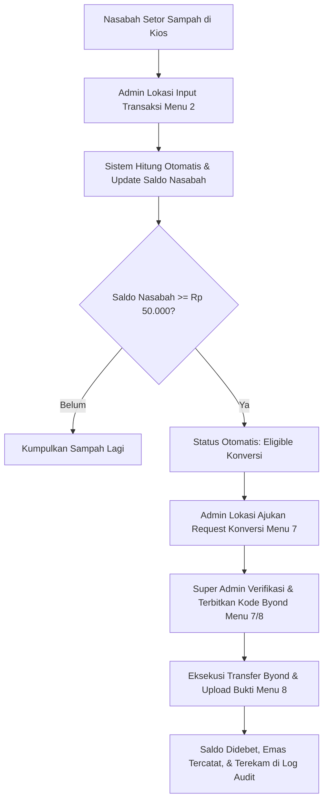

# Dokumentasi Sistem: Dashboard Standalone Kios Daur Ulang BSI x Kepul

Sistem mandiri (standalone) milik **PT Bank Syariah Indonesia Tbk (BSI)** — Unit ESG Operations & Communication, yang dibangun berdasarkan **Product Requirement Document (PRD) Draft v2.0**.

Sistem ini mereplikasi alur bisnis operasional Kios Daur Ulang di 5 lokasi tanpa bergantung pada akses backend langsung Kepul, dilengkapi kontrol hak akses (RBAC), Row Level Security (RLS) per lokasi kios, verifikasi konversi Tabungan Emas via Byond, dan pelaporan ESG terstandardisasi.

---

## 1. Identitas Visual & Desain Brand BSI
Mengacu pada identitas korporat BSI (*bankbsi.co.id*):
- **Warna Primer**: BSI Teal (`#00A39D`) — melambangkan keteduhan dan keuangan syariah berkelanjutan.
- **Warna Aksen**: BSI Gold / Orange (`#F8AD3C`) — melambangkan kemakmuran dan program Tabungan Emas.
- **Tipografi**: *Plus Jakarta Sans* & *Lato* modern-profesional.
- **Nuansa Geometris ESG**: Indikator dampak ekologis (*trees saved*, reduksi emisi $CO_2$, energi terhemat).

---

## 2. Struktur Pengguna & Kredensial UAT (RBAC)
Tersedia **7 akun pengguna** siap uji yang dapat langsung dialihkan secara instan melalui tombol **Simulasi Akses Pengguna (RBAC)** di pojok kanan atas Header:

| No | Username | Nama | Role | Cakupan Wilayah (RLS) | Akses Utama |
|---|---|---|---|---|---|
| 1 | `super_admin` | Rian Pratama, S.E. | `super_admin` | Semua Lokasi (Lintas Kios) | Akses penuh, verifikasi konversi emas, kelola pengguna & katalog harga sampah |
| 2 | `bsi_viewer` | Clarissa Maharani | `bsi_viewer` | Semua Lokasi (Lintas Kios) | Read-only pemantauan agregat, review log audit, unduh laporan Excel |
| 3 | `admin_malibu` | Ahmad Fauzi | `admin_lokasi` | Malibu Village Gading Serpong | Input transaksi, kelola nasabah & ajukan konversi lokasi Malibu |
| 4 | `admin_viladago` | Siti Rahmawati | `admin_lokasi` | Vila Dago Pamulang | Input transaksi, kelola nasabah & ajukan konversi lokasi Vila Dago |
| 5 | `admin_samara` | Budi Santoso | `admin_lokasi` | Samara Village Serpong | Input transaksi, kelola nasabah & ajukan konversi lokasi Samara |
| 6 | `admin_pasarmodern` | Dewi Lestari | `admin_lokasi` | Pasar Modern Paramount | Input transaksi, kelola nasabah & ajukan konversi lokasi Pasar Modern |
| 7 | `admin_hafidz` | Ustadz Syarif Hidayat | `admin_lokasi` | Pesantren Hafidz Indonesia Centre | Input transaksi, kelola nasabah & ajukan konversi lokasi Hafidz |

---

## 3. Cakupan 15 Menu Lengkap (PRD Bagian 5)

### Operasional Kios
1. **Menu 1: Ringkasan (Dashboard)**: KPI utama (Total Nilai Ekonomi, Total Berat Sampah, Nasabah Aktif, Saldo Tereligibel Emas), metrik dampak lingkungan ESG, grafik tren transaksi harian, dan distribusi kategori sampah.
2. **Menu 2: Buat Transaksi**: Input setoran sampah multi-item per nasabah dari 16 jenis katalog, otomatis menghitung bobot dan rupiah, otomatis memperbarui saldo nasabah, serta mendeteksi langsung status kelayakan konversi emas.
3. **Menu 3: Riwayat Transaksi**: Tabel pencarian transaksi historis dengan filter lokasi, modal rincian item, dan pintasan cetak struk.
4. **Menu 4: Cetak Struk**: Format struk resmi cetak slip transaksi BSI x Kepul dengan kode QR verifikasi, rincian item, perubahan saldo, dan catatan dampak lingkungan.
5. **Menu 5: Data Nasabah**: Profil nasabah terdaftar, No. WhatsApp, No. Rekening BSI, No. Rekening Tabungan Emas, modal registrasi baru dan riwayat transaksi nasabah.
6. **Menu 6: Saldo & Kelayakan**: Pemantauan nasabah berdasarkan ambang batas kelayakan minimal Rp 50.000 dengan tombol aksi langsung pengajuan konversi.

### Tabungan Emas & Byond
7. **Menu 7: Konversi Emas**: Alur permintaan konversi saldo sampah ke Tabungan Emas BSI: *Diajukan* &rarr; *Verifikasi Super Admin* &rarr; *Diproses Byond* &rarr; *Selesai*.
8. **Menu 8: Transfer Byond**: Pemantauan transfer Byond, upload bukti transfer struk digital, verifikasi kode referensi Byond, dan mutasi saldo nasabah.

### Master Data & Lokasi
9. **Menu 9: Katalog Harga Sampah**: Master 16 jenis sampah (Plastik PET/PP/HDPE, Kertas HVS/Kardus/Duplex, Aluminium/Besi/Tembaga/Kuningan, Botol Kaca, Minyak Jelantah) dengan harga beli per kg yang dapat diubah oleh Super Admin.
10. **Menu 10: Lokasi Kios**: Profil 5 Kios Daur Ulang, alamat lengkap, PIC admin, jam operasional, dan target bulanan.
11. **Menu 11: Performa & Target Lokasi**: Grafik perbandingan target vs realisasi volume (kg) dan nilai rupiah, serta leaderboard peringkat kios teraktif.
12. **Menu 12: Sampah & Nilai Ekonomi**: Analitik 5 jenis sampah teratas berdasarkan volume dan kontribusi nilai ekonomi rupiah.

### Pelaporan & Governance
13. **Menu 13: Laporan Export Excel**: Ekspor file `.xlsx` terformat untuk 4 kategori laporan (Transaksi, Rekapitulasi Nasabah, Kinerja Lokasi ESG, dan Konversi Tabungan Emas).
14. **Menu 14: Pengguna & RBAC**: Pengelolaan akun pengguna, status aktif/nonaktif, reset kredensial, dan tabel matriks izin RBAC.
15. **Menu 15: Log Audit**: Audit trail kronologis setiap aktivitas penting (transaksi dibuat, konversi diajukan/diverifikasi, harga diubah, transfer Byond) lengkap dengan timestamp, pelaku, peran, target ID, dan alamat IP.

---

## 4. Alur Bisnis End-to-End (Business Flow)



---

## 5. Cara Menjalankan Sistem Secara Lokal

1. Pastikan dependensi sudah terinstal:
   ```bash
   npm install
   ```

2. Jalankan server pengembangan Vite:
   ```bash
   npm run dev
   ```

3. Buka browser pada alamat:
   ```
   http://localhost:5173/
   ```

4. Untuk build bundle produksi:
   ```bash
   npm run build
   ```
